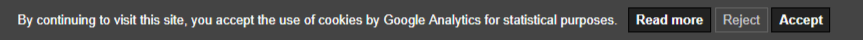

<h1 align="center">Cookies EU banner</h1>

<p align="center">
    <a href="https://bundlephobia.com/result?p=cookies-eu-banner"></a>
    <a href="https://www.npmjs.com/package/cookies-eu-banner"></a>
    <a href="https://github.com/Alex-D/cookies-eu-banner/blob/master/LICENSE"></a>
    <br>
    <a href="https://www.npmjs.com/package/cookies-eu-banner"></a>
    
</p>

<h2 align="center">Screenshot</h2>

<p align="center">
    <a href="https://alex-d.github.io/Cookies-EU-banner/demo"></a>
</p>

<h2 align="center">Supporting Cookies EU banner</h2>

Cookies EU banner is an MIT-licensed open source project and completely free to use.
You can support it's ongoing development by being a backer or a sponsor:
 
- [Become a backer or sponsor on Patreon](https://www.patreon.com/alexandredemode)
- [One-time donation via PayPal](https://www.paypal.me/alexandredemode/20eur)

-----

## Introduction

Cookies EU banner manage display of a banner which allows user to accept or reject cookies from tracking services like Google Analytics.
It is a GDPR-compliant way to get cookie consent from visitors.

- [Try Cookies EU banner demo in action](https://alex-d.github.io/Cookies-EU-banner/demo)
- [Go to presentation website](https://alex-d.github.io/Cookies-EU-banner/)

## Installation

### Get the script

- Using npm: `npm install cookies-eu-banner --save`
- Or using yarn: `yarn add cookies-eu-banner`
- Or using bower: `bower install cookies-eu-banner --save`
- Or [download the latest version](https://github.com/Alex-D/cookies-eu-banner/archive/master.zip).


### In your pages

Insert the banner before any content at the beginning of the `<body>` element, with these IDs:

```html
<div id="cookies-eu-banner" style="display: none;">
    By continuing to visit this site, you accept the use of cookies by Google Analytics for statistical purposes.
    <a href="./read-more.html" id="cookies-eu-more">Read more</a>
    <button id="cookies-eu-reject">Reject</button>
    <button id="cookies-eu-accept">Accept</button>
</div>
```


- `#cookies-eu-banner` is the div that contains all elements to be hidden after user accepts or declines the use of cookies;
- `#cookies-eu-more` is a link to a "Read more" page where you explain your use of cookies;
- `#cookies-eu-reject` and `#cookies-eu-accept` are the buttons used to reject/accept cookies.


Before the end of `<body>`, or in a script file inserted at the same place, put the following code:

```html
<script src="cookies-eu-banner/dist/cookies-eu-banner.min.js"></script>
<script>
    new CookiesEuBanner(function () {
        // Your code to launch when user accept cookies
    });
</script>
```

Example for Google Analytics:

```html
<script src="cookies-eu-banner/dist/cookies-eu-banner.min.js"></script>
<script>
    new CookiesEuBanner(function () {
        (function(i,s,o,g,r,a,m){i['GoogleAnalyticsObject']=r;i[r]=i[r]||function(){
        (i[r].q=i[r].q||[]).push(arguments)},i[r].l=1*new Date();a=s.createElement(o),
        m=s.getElementsByTagName(o)[0];a.async=1;a.src=g;m.parentNode.insertBefore(a,m)
        })(window,document,'script','//www.google-analytics.com/analytics.js','ga');

        // Don't forget to put your own UA-XXXXXXXX-X code
        ga('create', 'UA-XXXXXXXX-X', 'auto');
        ga('send', 'pageview');
    });
</script>
```

### Options

#### waitAccept

The second parameter (`true` in the example below) define if Cookie EU banner wait the user acceptation before hide the banner. Set to `false` by default.

```html
<script>
    new CookiesEuBanner(function () {
        // Your code to launch when user accept cookies
    }, true);
</script>
```

#### useLocalStorage

If you really don't want save the consent in a cookie, you can use localStorage.

The third parameter (`true` in the example below) define if Cookie EU banner use localStorage (`true`) or cookie (`false`). Set to `false` by default.

*Note: the localStorage method is not as good as the cookie method since the localStorage cannot expires after 13 months as recommended.*

```html
<script>
    new CookiesEuBanner(function () {
        // Your code to launch when user accept cookies
    }, false, true);
</script>
```

#### waitRemove

If you want add some transition on accept/reject, and want to prevent the premature deletion of the banner, you can add
`data-wait-remove` attribute to the banner, with the time to wait in milliseconds. 

```html
<div id="cookies-eu-banner" style="display: none;" data-wait-remove="250">
    <!-- ... -->
</div>
```

## How does it work?

For a detailed explanation, see comments in the main file: [cookies-eu-banner.js](src/cookies-eu-banner.js).

In short:

1. Excludes bots, clients who have DoNotTrack activated, and users who have already declined;
2. Runs your custom function if user has already accepted;
3. Shows banner, then:
    - if user accepts, run custom function and put a cookie to save this acceptance;
    - if user declines, remove all Google Analytics cookies and put a cookie to save this rejection.


## Features

- Do Not Track detection (IE9+, Firefox, and all browsers compatible with the `navigator.doNotTrack` JavaScript variable);
- Disables banner when visitor is a bot: prevents SEO Engines to confuse your cookie advert message with the main content of your pages;
- Respects [all points imposed by CNIL (FR)](https://www.cnil.fr/fr/solutions-pour-les-cookies-de-mesure-daudience) and [these points](https://www.cnil.fr/fr/cookies-traceurs-que-dit-la-loi).


## Contribute

This project use Gulp.
To contribute, you need [Node.js](http://nodejs.org/) and npm (or yarn).
Then, in the Cookies EU banner folder, run these commands:

```console
npm install
npm run start

# or

yarn
yarn start
```

The first line install all dependencies.
The second line builds the min file and watch for changes to rebuild it on the fly.


## Supported browsers

All browsers desktop/mobile: IE8+, Edge, Firefox, Chrome, Safari, Opera, ...
