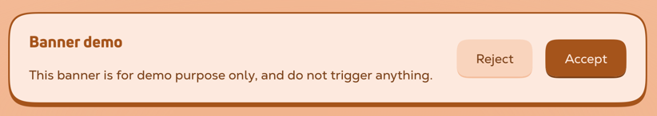

<h1 align="center">Cookies EU banner</h1>

<p align="center">
    <a href="https://bundlejs.com/?q=cookies-eu-banner"></a>
    <a href="https://npmx.dev/package/cookies-eu-banner"></a>
    <a href="https://github.com/Alex-D/cookies-eu-banner/blob/main/LICENSE"></a>
</p>

<h2 align="center">Screenshot</h2>

<p align="center">
    <a href="https://alex-d.github.io/Cookies-EU-banner/demo"></a>
</p>

<h2 align="center">Supporting Cookies EU banner</h2>

Cookies EU banner is an MIT-licensed open source project and completely free to use.
You can support its ongoing development by being a backer or a sponsor:

- [Become a backer or sponsor on Patreon](https://www.patreon.com/alexandredemode)
- [One-time donation via PayPal](https://www.paypal.me/demodealexandre/20eur)

---

## Introduction

Cookies EU banner manage display of a banner which allows user to accept or reject cookies from tracking services like Google Analytics.
It is a GDPR-compliant way to get cookie consent from visitors.

- [Try Cookies EU banner demo in action](https://alex-d.github.io/Cookies-EU-banner/demo)
- [Go to presentation website](https://alex-d.github.io/Cookies-EU-banner/)

### Features

- Do Not Track detection, using `navigator.doNotTrack`
- Disables banner when the visitor is a bot: prevents SEO Engines from confusing your cookie advert message with the main content of your pages
- Respects GDPR
- Fully typed, since it's written in TypeScript
- [Offers a headless version](#advanced-headless)

## How to use?

### 1. Add the template

Insert the banner at the end of the `<body>` element, using a `<template>` with these IDs:

```html
<template id="cookies-eu-banner-template">
	<div id="cookies-eu-banner">
		By continuing to visit this site, you accept the use of cookies by Google Analytics for
		statistical purposes.
		<button id="cookies-eu-reject">Reject</button>
		<button id="cookies-eu-accept">Accept</button>
	</div>
</template>
```

### 2. Import the script

Choose one of these options:

- [Using a build step](#using-a-build-step)
- Using a CDN:
  - [Global build, the good old `<script src="..."`](#cdn-or-local-copy-global-build-import-via-script-src)
  - [ESM build, import via `<script type="module">`](#cdn-or-local-copy-es-module-build-esm)

#### Using a build step

| Package manager | Command                                |
| --------------- | -------------------------------------- |
| Vite+           | `vp add cookies-eu-banner`             |
| pnpm            | `pnpm add cookies-eu-banner`           |
| npm             | `npm install cookies-eu-banner --save` |
| yarn            | `yarn add cookies-eu-banner`           |

```js
import { createCookiesBanner } from "cookies-eu-banner";

createCookiesBanner({
	onAccept: () => {
		// Your code to launch when the user accepts cookies
	},
});
```

#### CDN or local copy: Global build (import via `<script src="...">`)

This will expose `CookiesEuBanner` as global, allowing you to call the `createCookiesBanner` function like this:

```html
<script src="https://unpkg.com/cookies-eu-banner@^3/dist/cookies-eu-banner.global.js"></script>
<!--
Or if you have downloaded the package, you can import it locally instead:
<script src="./your-path/cookies-eu-banner.global.js"></script>
-->
<script>
	CookiesEuBanner.createCookiesBanner({
		onAccept: () => {
			// Your code to launch when the user accepts cookies
		},
	});
</script>
```

#### CDN or local copy: ES Module build (ESM)

```html
<script type="module">
	import { createCookiesBanner } from "https://unpkg.com/cookies-eu-banner@^3/dist/cookies-eu-banner.js";

	// Or if you have downloaded the package, you can import it locally instead:
	// import { createCookiesBanner } from "./your-path/cookies-eu-banner.js";

	createCookiesBanner({
		onAccept: () => {
			// Your code to launch when the user accepts cookies
		},
	});
</script>
```

### Advanced: Headless

As an alternative, you can take the full control over the UI side. Get the Cookies EU Banner's core logic: you can use your classes, your framework, ...

A simple example of what you can do:

```html
<script type="module">
	import { createHeadlessCookiesBanner } from "cookies-eu-banner/headless";
	// or from CDN
	// import { createHeadlessCookiesBanner } from "https://unpkg.com/cookies-eu-banner@^3/dist/cookies-eu-banner.headless.js";

	const listenersController = new AbortController();
	/** @type HTMLDivElement */
	const bannerElement = document.querySelector("#my-banner");

	const cookiesBanner = createHeadlessCookiesBanner({
		showBanner: () => {
			// Create or bind to the banner

			// Example
			bannerElement.style.display = "block";
			bannerElement.ariaHidden = "false";

			document.querySelector("#my-accept-button").addEventListener(
				"click",
				() => {
					cookiesBanner.setConsent(true);
				},
				{ signal: listenersController.signal },
			);

			document.querySelector("#my-reject-button").addEventListener(
				"click",
				() => {
					cookiesBanner.setConsent(false);
				},
				{ signal: listenersController.signal },
			);
		},
		onAccept: () => {
			// Your code to launch when the user accepts cookies

			// Your code to hide/remove the banner
			bannerElement.remove();

			listenersController.abort(); // Remember to remove listeners
		},
		onReject: () => {
			// Your code to launch when the user rejects cookies

			// Your code to hide/remove the banner
			bannerElement.remove();

			listenersController.abort(); // Remember to remove listeners
		},
	});

	// You get the control of when to launch the init
	cookiesBanner.init();
</script>
```

#### Headless using Global

```html
<script src="https://unpkg.com/cookies-eu-banner@^3/dist/cookies-eu-banner.global.js"></script>
<script>
	const cookiesBanner = CookiesEuBanner.createHeadlessCookiesBanner({
		// ...
	});
	cookiesBanner.init();
</script>
```

## How does it work?

For a detailed explanation, see comments in the main files: [src/index.ts](src/index.ts) and [src/headless.ts](src/headless.ts).

In short:

1. Hide the banner from bots, clients who have DoNotTrack activated, and users who have already declined;
2. Runs your custom function if the user has already accepted;
3. Shows the banner, then:
   - if the user accepts, run your custom function and put a cookie to save this acceptance;
   - if the user declines, remove all Google Analytics cookies (see `trackingCookieNames` option) and put a cookie to save this rejection.

## Technical choices

### Why using `document.cookie` instead of CookieStore?

Safari only supports `cookieStore.set()` in **https**, making it harder to use in local development for beginners.

## Contribute

To contribute, you need [Vite+](https://viteplus.dev/guide/).
Then, in the Cookies EU banner folder, run these commands:

```console
vp install
vp run dev
# or
vp run dev:all
```

The first line installs all dependencies.
The second line builds the min file and watches for changes to rebuild it on the fly.

## Supported browsers

All baseline browsers, desktop/mobile: Edge, Firefox, Chrome, Safari, Opera, ...
